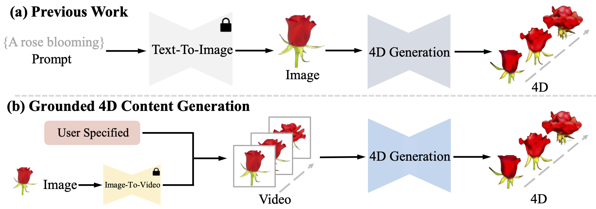

# 4DGen: Grounded 4D Content Generation with Spatial-temporal Consistency
Authors: Yuyang Yin, Dejia Xu, Zhangyang Wang, Yao Zhao, Yunchao Wei

[[Project Page]](https://vita-group.github.io/4DGen/) | [[Video (narrated)]](https://www.youtube.com/watch?v=-bXyBKdpQ1o) | [[Video (results only)]](https://www.youtube.com/watch?v=Hbava1VpeXY) | [[Paper]](https://github.com/VITA-Group/4DGen/blob/main/4dgen.pdf) | [[Arxiv]](https://arxiv.org/abs/2312.17225)

<!--  -->



## News
- `2023/12/28`  First release code and paper.
- `2024/2/14`   Update text-to-4d and image-to-4d functions and cases.
- `2024/3/17`   Add a completed example script.

## Task Type
As show in figure above, we define grounded 4D generation, which focuses on video-to-4D generation. Video is not required to be user-specified but can also be generated by video diffusion. With the help of [stable video diffusion](https://github.com/nateraw/stable-diffusion-videos), we implement the function  of image-to-video-to-4d  and text-to-image-to-video-to-4d . Due to the unsatisfactory performance of the text-to-video model, we use [stable diffusion-XL](https://huggingface.co/stabilityai/stable-diffusion-xl-base-1.0) and [stable video diffusion](https://github.com/nateraw/stable-diffusion-videos) implement the function  of text-to-image-to-video-to-4d. Therefore, our model support **text-to-4D** and **image-to-4D** tasks.


## Setup

```bash
conda env create -f environment.yml
conda activate 4DGen
pip install -r requirements.txt

# 3D Gaussian Splatting modules, skip if you already installed them
# a modified gaussian splatting (+ depth, alpha rendering)
git clone --recursive https://github.com/ashawkey/diff-gaussian-rasterization
pip install ./diff-gaussian-rasterization
pip install ./simple-knn

# install kaolin for chamfer distance (optional)
# https://kaolin.readthedocs.io/en/latest/notes/installation.html
# CHANGE the torch and CUDA toolkit version if yours are different
# pip install kaolin -f https://nvidia-kaolin.s3.us-east-2.amazonaws.com/torch-1.12.1_cu116.html
```

## Example Case Script
We have organized a complete pipeline script in **main.bash** for your reference. You need to modify the necessary paths.


## Data Preparation

We release our collected data in [Google Drive](https://drive.google.com/drive/folders/1-lbtj-YiA7d0Nbe6Qcc_t0W_CKKEw_bm?usp=drive_link). Some of these data are user-specified, while others are generated. 

Each test case contains two folders: `{name}_pose0` and `{name}_sync`. `pose0` refers to the monocular video sequence. `sync` refers to the pseudo labels generated by [SyncDreamer](https://github.com/liuyuan-pal/SyncDreamer).

We recommend using [Practical-RIFE](https://github.com/hzwer/Practical-RIFE) if you need to introduce more frames in your video sequence.

**Text-To-4D data prepartion**

Use [stable diffusion-XL](https://huggingface.co/stabilityai/stable-diffusion-xl-base-1.0) to generate your own images. Then use image-to-video script below.

**Image-To-4D data prepartion**
```bash
python image_to_video.py --data_path {your image.png} --name {file name}  #It may be necessary to try multiple seeds to obtain the desired results.
```

**Preprocess data format for training** 

To preprocess your own images into RGBA format, you can use `preprocess.py` .

To preprocess your own images to multi view images, you can use [SyncDreamer](https://github.com/liuyuan-pal/SyncDreamer) script，then use `preprocess_sync.py` to get a uniform format.

```bash
# for monocular image sequence
python preprocess.py --path xxx
# for images generated by syncdreamer
python preprocess_sync.py --path xxx
```

## Training

```bash
python train.py --configs arguments/i2v.py -e rose --name_override rose
```

## Rendering

```bash
python render.py --skip_train --configs arguments/i2v.py --skip_test --model_path "./output/xxxx/"
```


## Evaluation
Please see main.bash.

<!-- As for CLIP loss, we calculate clip distance loss between rendered images and reference images. The refernce images are n frames. The rendered images are 10 viewpoints in each timestep. 

As for CLIP-T loss, we choose to also measure CLIP-T distance at different viewpoint, not only for the frontal view but also for the back and side views.

```bash
cd evaluation
bash eval.bash  #please change file paths before running
``` -->


## Result ##
We show part of results in our [web pages](https://vita-group.github.io/4DGen/).

Image-to-4D results:
| frontview_mario   | multiview_mario   |
| :----------------:|:-----------------:|
|  |  |

Text-to-4D results:

We first use stable-diffusion-xl to generate a static image. Prompt is 'an emoji of a baby panda, 3d model, front view'. 
| frontview_panda   | multiview-panda   |
| :----------------:|:-----------------:|
|  |  |


## Acknowledgement

This work is built on many amazing research works and open-source projects, thanks a lot to all the authors for sharing!

- https://github.com/dreamgaussian/dreamgaussian
- https://github.com/hustvl/4DGaussians
- https://github.com/graphdeco-inria/gaussian-splatting
- https://github.com/graphdeco-inria/diff-gaussian-rasterization
- https://github.com/threestudio-project/threestudio

## Our new work
We release our new work [Diffusion4D: Fast Spatial-temporal Consistent 4D Generation via Video Diffusion Models]([Diffusion4D: Fast Spatial-temporal Consistent 4D Generation via Video Diffusion Models](https://vita-group.github.io/Diffusion4D/)). You can click project page to learn more detail. Thanks for your suppport.


## Citation
If you find this repository/work helpful in your research, please consider citing the paper and starring the repo ⭐.

```
@article{yin20234dgen,
  title={4DGen: Grounded 4D Content Generation with Spatial-temporal Consistency},
  author={Yin, Yuyang and Xu, Dejia and Wang, Zhangyang and Zhao, Yao and Wei, Yunchao},
  journal={arXiv preprint arXiv:2312.17225},
  year={2023}
}}
```
